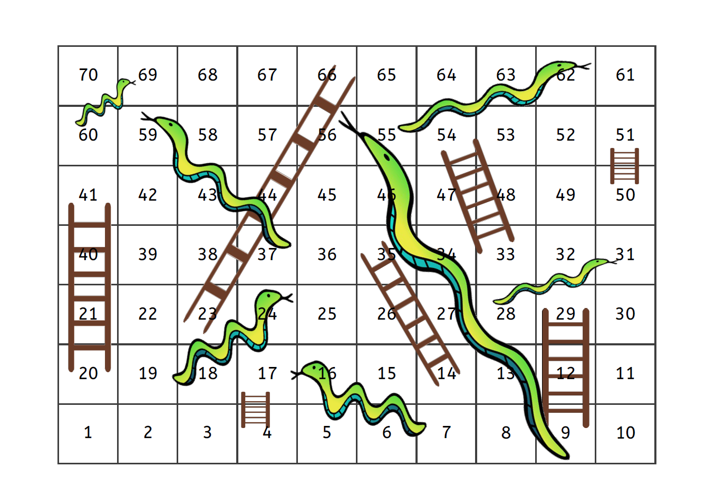

### Leiterspiel
##### Michael Bertschi & Rehan Beg Mirza

Ein Leiterspiel-Spielplan enthält eine Kette von Spielfeldern, die von einem Start- zu einem Zielfeld führt und sich spiralförmig oder im Zickzack windet. An mehreren Stellen sind zwei nicht direkt aufeinanderfolgende Felder durch Schlangen, Leitern oder andere Zeichnungen verbunden. Das Spiel ist in seiner Grundform ein reines Glücksspiel ohne strategische Elemente.

Das Spiel enthält eine Kette von Spielfeldern, die von einem Start- zu einem Zielfeld führt und sich spiralförmig oder im Zickzack windet. An mehreren Stellen sind zwei nicht direkt aufeinanderfolgende Felder durch Schlangen, Leitern oder andere Zeichnungen verbunden.

# Here comes the documentation of file architecture
#Where to find the javafx src...